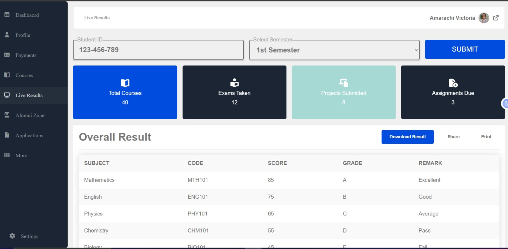
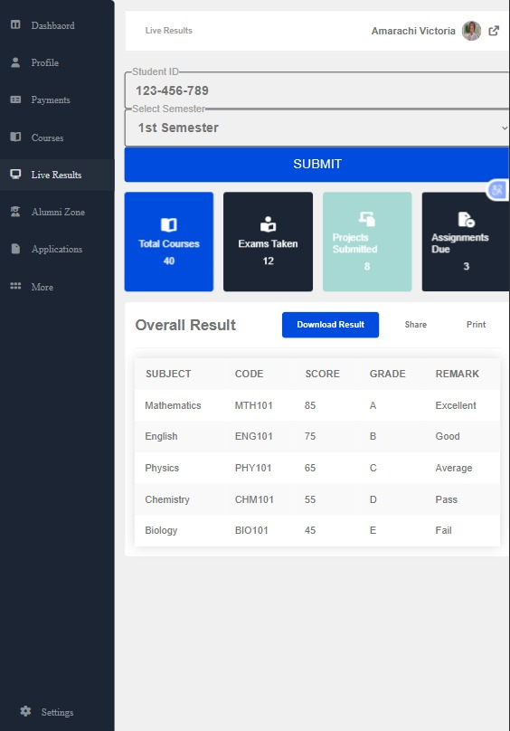

# Exam Result Dashboard

## Overview
This project is a web-based dashboard designed to display student exam results in a clear and structured format. It focuses on presenting data in a way that is easy to understand and visually accessible.

## Problem It Solves
Raw academic results can be difficult to interpret quickly. This dashboard helps:
- Organize student performance data
- Present results in a clear format
- Improve readability and user understanding

## Features
- Structured result display
- Clean and organized layout
- Responsive design for different screen sizes

## Problems I Solved
- Improved readability of complex data
- Structured layout for better user experience
- Ensured consistent alignment and spacing

## Preview

## Technology Used
- HTML

## How to Use
1. Open the application
2. View the results displayed on the dashboard
3. Navigate through sections that are available

## Future Improvements
- Add filtering and search functionality
- Integrate real-time data
- Improve visualizations (charts, graphs)

## Lessons Learned
- Presenting data in a user-friendly format
- Designing structured layouts
- Improving UI clarity
